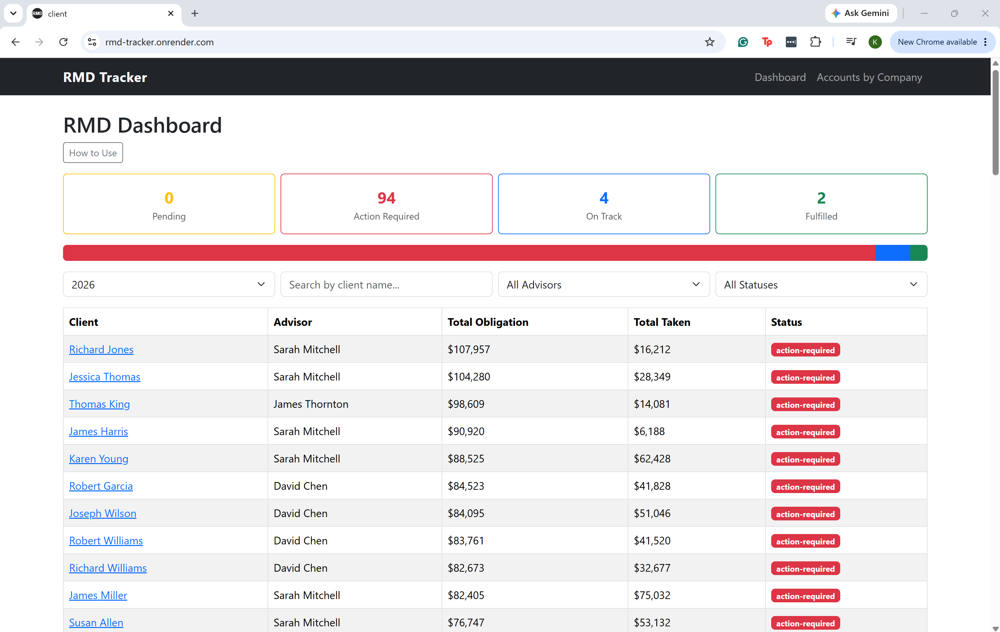

# RMD Tracker

**Author:** Kaylee Faherty & Haotian Qian  
**Class:** [CS5610 Web Development – Northeastern University](https://johnguerra.co/classes/webDevelopment_online_summer_2026/)
**Deployed App:** https://rmd-tracker.onrender.com
**Design Document:** [View Design Document](DESIGN.pdf)

## Project Objective

RMD Tracker is a full-stack web application designed to help financial advisors manage Required Minimum Distributions (RMDs) for their clients. Once a client reaches age 73, the IRS requires a minimum annual withdrawal from their retirement accounts or they face a penalty. At small offices this process is often managed manually in shared spreadsheets, which can create inconsistencies when multiple staff members track completion differently.

RMD Tracker centralizes this workflow into a single dashboard where advisors and their staff can manage clients, track accounts across multiple custodians, calculate total RMD obligations, and monitor fulfillment status across their entire book of business. Account distribution settings carry over year to year, so advisors only need to verify and update amounts rather than re-enter everything from scratch.

## Screenshot



## Demo Credentials

- **Username:** demo@rmdtracker.com
- **Password:** password123

## Tech Stack

- **Frontend:** React with Hooks, React Bootstrap
- **Backend:** Node.js + Express
- **Database:** MongoDB (Native Node.js Driver)
- **Authentication:** Passport
- **Deployment:** Render

## Instructions to Build

### Prerequisites

- Node.js v18+
- MongoDB Atlas account

### Setup

1. Clone the repository:

```bash
git clone https://github.com/Fahertyk-NU/rmd-tracker.git
cd rmd-tracker
```

2. Install server dependencies:

```bash
cd server
npm install
```

3. Create a `.env` file in the `server` folder:

MONGO_URI=your_mongodb_connection_string

SESSION_SECRET=your_secret_here

4. Seed the database:

```bash
node seed.js
```

5. Install client dependencies:

```bash
cd ../client
npm install
```

6. Start the development servers:

In one terminal (server):

```bash
cd server
npm run dev
```

In another terminal (client):

```bash
cd client
npm run dev
```

7. Open http://localhost:5173 in your browser.

## AI Usage Disclosure

**Kaylee Faherty:** Claude Sonnet (Anthropic, claude-sonnet-4-6) was used throughout this project as a learning guide and coding assistant. It was used to explain concepts, talk through architectural decisions, troubleshoot errors, and suggest approaches as I built out the Express/MongoDB backend, React frontend, and CSS. All generated code was carefully reviewed, tested, and understood before being committed. Key prompts included project planning, setting up the Express/MongoDB architecture, implementing CRUD routes, designing the RMD status logic and aggregation pipeline, and building the accounts by company workflow view. Domain knowledge and all financial services concepts came from my own professional experience.

**Haotian Qian** [To be completed by Haotian]
